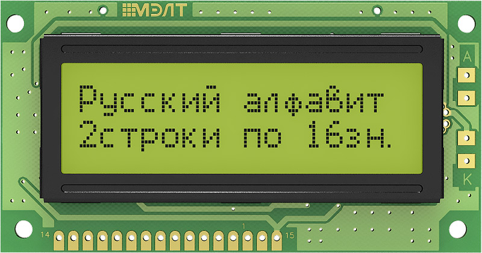

# Описание

## Введение

Данный проект имеет целью изучение, установка, программирование Linux для втсраиваемых систем (Embedded System).

За основу взята отладочная плата 
<a href="https://www.microchip.com/en-us/development-tool/atsama5d27-som1-ek1">SAMA5D27-SOM1-EK1</a>.

    

На плате установлен модуль
<a href="https://www.microchip.com/en-us/product/ATSAMA5D27-SOM1">ATSAMA5D27-SOM1</a>, с процессором
<a href="https://www.microchip.com/en-us/product/ATSAMA5D27">ATSAMA5D27</a>.

Для своих процессоров и плат, организация
<a href="https://www.microchip.com/">Microchip</a> предоставляет доступ к программам (Linux) и инструментам для разработки на сайте
<a href="http://www.linux4sam.org/">www.linux4sam.org</a>

Для нашей платы - 
<a href="https://www.linux4sam.org/bin/view/Linux4SAM/Sama5d27Som1EKMainPage">SAMA5D27 SOM1 Evaluation Kit</a>

## Задача

Основная задача, которая была поставлена в качестве учебной, написать драйвер под систему Linux.

Какое оборудование подключать к данной плате (соответственно, для какого оборудования писать драйвер), пока не ясно. Самое первое, что пришло в голову, попробовать подключить знакосинтезирующий ЖК индикатор, например,
<a href="http://www.melt.com.ru/shop/mt-16s2h-2ylg.html">MT-16S2H-2YLG</a>

    

